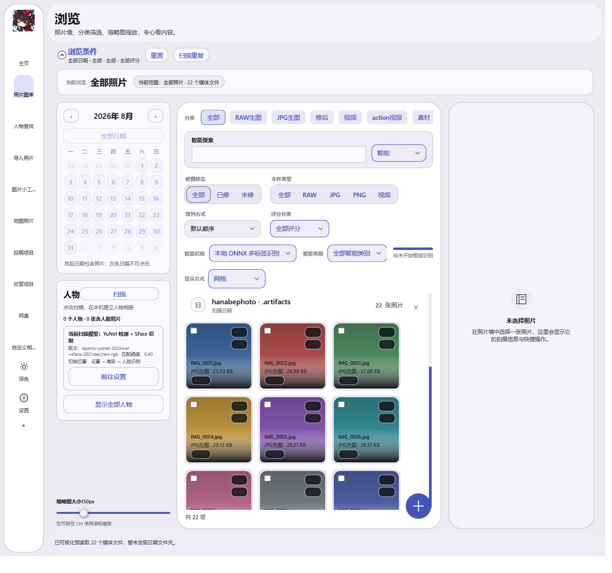
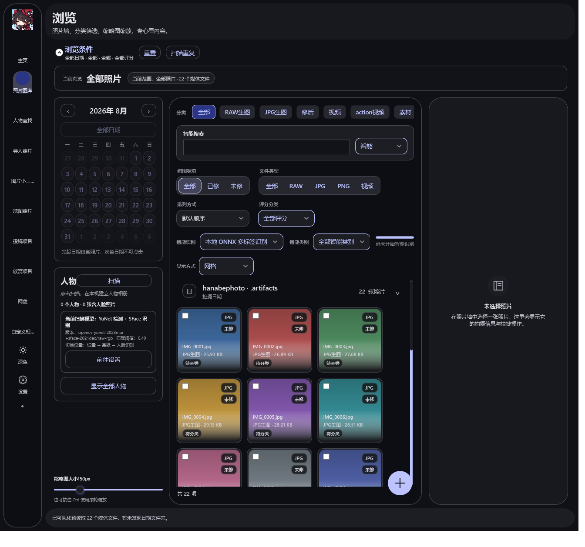
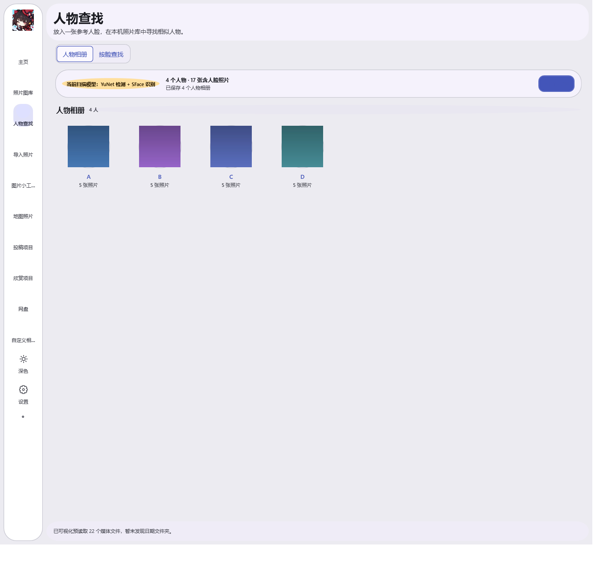
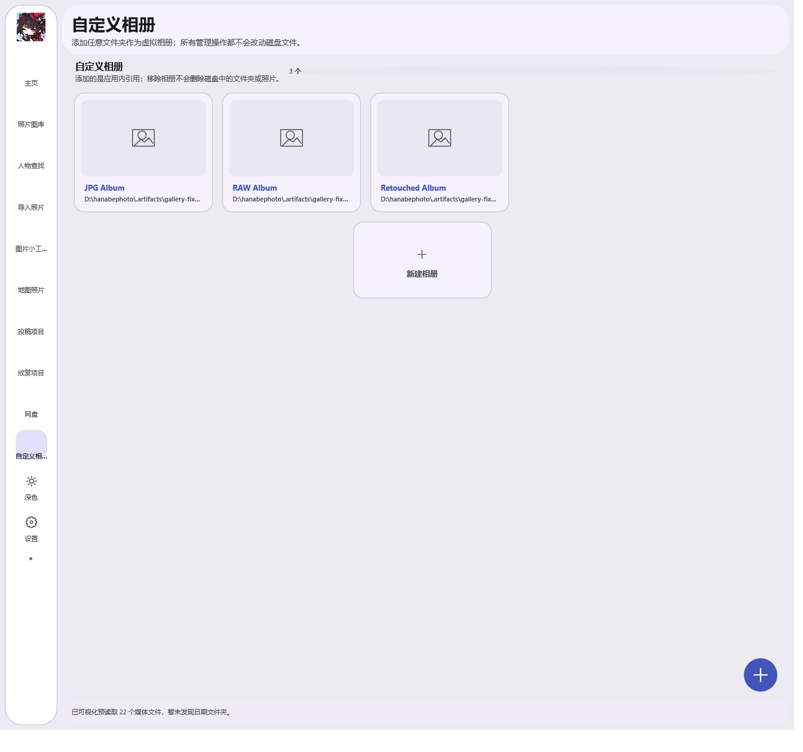
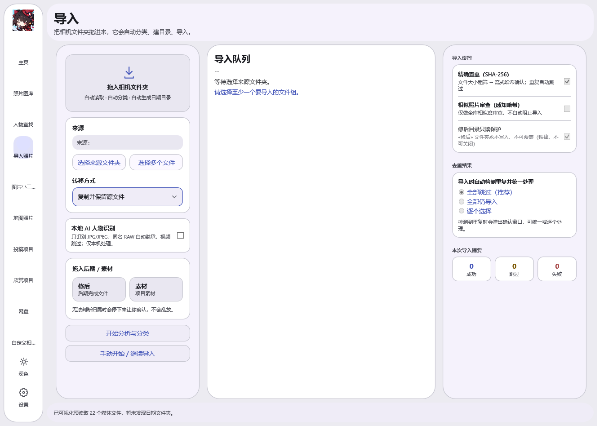
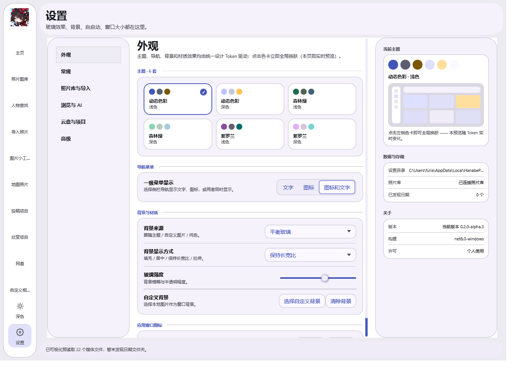
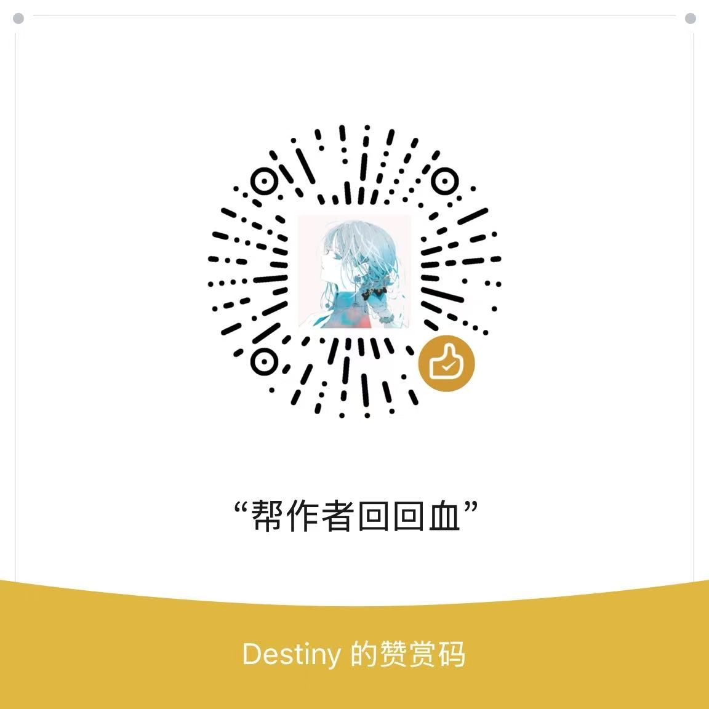

# Hanabe Photo Manager

> 写真ワークフローのためのローカル写真管理デスクトップアプリ · セマンティック検索 / 人物認識 / ツリーマップ閲覧 / バッチツール

Hanabe Photo Manager は、写真家（とくにコスプレ撮影）のための Windows デスクトップ写真管理ツールです。**Lightroom のような整理機能**、**Google Photos のようなスマート検索**、そして **Material Design 3 のモダンな UI** をローカルアプリに統合——あなたの写真はいつまでも自分のハードディスクの中に残ります。


**Read this in:** [English](README.md) · [日本語](README.ja.md) · [简体中文](README.zh-CN.md)

---

## ✨ 主な機能

### 📂 スマート閲覧（フォトウォール）
- **3つのビュー**：ツリーマップ（Treemap）/ グリッド / ウォーターフォール。仮想化レンダリングにより、数万枚の写真もミリ秒単位でスムーズにスクロール
- **スマートフィルター**：カテゴリ（RAW / JPG / レタッチ済み / 動画 / 素材）、レタッチ状態、評価、ファイルタイプ
- **日付カレンダー**：撮影日からすばやく写真を特定
- **Ctrl+ホイール** でサムネイルを即座にズーム

### 🔍 セマンティック検索（ローカル AI）
- **CLIP モデルによる意味検索**：「赤いワンピース」「夜景ポートレート」「友達と川辺で」と入力すると、フォトウォールに関連結果を直接表示——すべてローカルの ONNX 推論で、写真がクラウドに送られることはありません
- ファイル名 / パス / 意味説明を統合した検索。インクリメンタルインデックスで検索しながら結果が順次表示

### 👤 人物認識
- **YuNet 顔検出 + SFace 顔認識**（OpenVINO）でローカルに人物アルバムを構築
- 人物の結合 / 名前変更、顔で似た写真を検索
- 100枚以上の人物写真も仮想化読み込みでスムーズにスクロール

### 🗺️ 地図写真
- EXIF GPS を読み取り、地図上で撮影場所ごとに写真を閲覧
- 手動タグ付けモード：地図上をクリックして緯度経度を自動入力、Ctrl/Shift 複数選択で一括タグ付け

### 🧰 バッチツール
- **画像圧縮** / **コラージュ** / **ウォーターマーク** の一括処理
- **微信（WeChat）送信**：3ステップのフロー（微信検出 → 送信先の指定 → 一括送信）
- **重複検出**：SHA-256 による完全一致チェック + 類似レビュー、インポート時のスマートな重複排除

### 📦 インポート & アルバム
- 一括インポート（コピー / 検証後の移動）、カテゴリの自動仕分け
- カスタムアルバム / フォルダ参照、カードフロー閲覧 + グリッド/リスト切り替え
- レタッチ済みディレクトリの読み取り専用保護（元画像の誤上書き防止）

### ☁️ クラウド & 投稿
- WebView2 埋め込みクラウドクライアント（百度网盘 OAuth）、転送キューの管理
- 投稿 / 展示プロジェクト：WebView2 ブラウザ + ローカル写真の連携

### 🎨 Material Design 3 デザインシステム
- **6テーマ**：ダイナミックカラー（インディゴ）/ フォレストグリーン / バイオレット × ライト/ダーク、アプリ内でワンクリック切り替え
- セマンティックトークン駆動の完全なデザインシステム（28dp の大きな角丸 / ステートレイヤー / 150〜220ms のモーション）
- Navigation Rail + Inspector + FAB のモダンな3ペイン構成

---

## 📸 スクリーンショット

| ブラウザ（ダイナミックカラー・ライト） | ブラウザ（ダーク） |
|---|---|
|  |  |

| 顔検索 | アルバム |
|---|---|
|  |  |

| インポート | 設定 |
|---|---|
|  |  |

---

## 🚀 クイックスタート

### 必要環境
- Windows 10/11
- [.NET 8 SDK](https://dotnet.microsoft.com/download/dotnet/8.0)

### ビルド & 実行

```bash
git clone https://github.com/dedsecaydin/HanabePhotoManager.git
cd HanabePhotoManager

# ビルド
dotnet build HanabePhotoManager.sln -c Release

# 実行
dotnet run --project src/HanabePhotoManager.App

# テスト（917 ユニットテスト）
dotnet test HanabePhotoManager.sln
```

### 発行（自己完結・単一ディレクトリ）

```bash
dotnet publish src/HanabePhotoManager.App -c Release -r win-x64 --self-contained true
```

---

## 🏗️ プロジェクト構成

```
src/
├── HanabePhotoManager.Core/          # ドメインモデル + サービスインターフェース（検索、パフォーマンス戦略、インポート計画）
├── HanabePhotoManager.Infrastructure/# インフラ（SQLite インデックス、CLIP 推論、ファイル転送、百度网盘、SHA-256）
└── HanabePhotoManager.App/           # WPF アプリケーション層（ページ、ViewModel、デザインシステム、コントロール）
    ├── Browsing/                     # 仮想化されたツリーマップ/グリッド/ウォーターフォール閲覧
    ├── Search/                       # セマンティック検索の統合
    ├── People/                       # 人物認識とアルバム
    ├── Compression/ Watermark/       # バッチツール
    ├── Cloud/                        # クラウドクライアント
    └── Themes/                       # Material Design 3 の6テーマトークン
```

---

## 🛠️ 技術スタック

| レイヤー | 技術 |
|---|---|
| フレームワーク | .NET 8 · WPF · MVVM (CommunityToolkit.Mvvm) |
| セマンティック検索 | ONNX Runtime · CLIP モデル · SQLite ベクトルインデックス |
| 人物認識 | OpenCvSharp4 · YuNet · SFace (OpenVINO) |
| クラウド | WebView2 · OAuth2 |
| テスト | xUnit · 917+ ユニットテスト |

---

## 🧠 開発の軌跡（バイブコーディングの記録）

このプロジェクトは完全な **バイブコーディング（AI 支援開発）** の実践例です——写真家が要件を出し、AI エージェントがアーキテクチャ・コーディング・テスト・反復開発を担当し、終始微信（WeChat）によるリモート指揮で進められました。

### 開発スタイル
- **要件駆動**：写真家（専業開発者ではない）が実際のワークフロー上のニーズ（意味検索、人物整理、バッチツール）を伝え、AI が実装
- **マルチエージェント分業**：
  - **Codex CLI (gpt-5.6-terra)**：高複雑度機能（ツリーマップ閲覧、仮想化、セマンティック検索統合）
  - **dsh / DeepSeek サブエージェント**：UI リファクタリング、機能ページ設計、テスト補完
  - **Hermes（オーケストレーター）**：要件分析、タスク分解、レビュー、リリース、運用
- **デザインファースト**：大きな改版は必ず HTML のモックアップを作成し、ユーザーが方向性を確認してから XAML を実装
- **テスト駆動**：917 のユニットテストがプロジェクトを守る（デザインシステム回帰テストが、ハードコードされた色や仕様外の角丸など UI の違反項目を自動検出）
- **イテレーションの流れ**：20% → 60% → 70% → 機能ページ再設計（人物/アルバム/インポート/設定/ツール/地図/クラウド）→ 6テーマ

### 主要な意思決定
| 決定 | 理由 |
|---|---|
| ローカルファースト（クラウドなし） | 作品のプライバシー + 数万枚の写真をアップロードする必要がない |
| CLIP + ONNX による意味検索 | ローカル推論、モデルが小さく高速 |
| 独自ツリーマップ仮想化 | 数万枚でもスムーズにスクロール——Lightroom にないビュー |
| Material Design 3 デザインシステム | モダンで上品なビジュアル言語、セマンティックトークンで全テーマ対応 |
| 3ペイン構成（Rail + ワークスペース + Inspector） | Codex Desktop / Lightroom に着想を得た情報密度 |

### タイムライン
- **2026-08-09**：プロジェクト開始、セマンティック検索の統合（インクリメンタルインデックス、検索しながら結果表示）
- **2026-08-10**：閲覧の仮想化（ツリーマップ/グリッドで 11,739 項目をミリ秒単位で処理）
- **2026-08-12**：デザインシステムの整備（トークン化、モーション仕様）
- **2026-08-14**：大胆な M3 リニューアル（6テーマ）+ 全機能ページの再設計 + 917 テスト全緑

---

## ☕ 作者を支援する

このツールが役に立つと思ったら、作者にコーヒー/コーラをごちそうしてください ☕🥤



- **微信（WeChat）赞赏码**：WeChat でスキャンして支援できます
- [愛発電 (Afdian)](https://afdian.com/a/hanabededsec) ｜ もし役に立ったら、Afdianで応援してね！

一杯のコーヒーが開発を続ける最大の原動力です！

---

## 📄 ライセンス

MIT License — 自由に使用・改変・再配布できます。

---

*Made with ❤️ by HANABE (花火) · 写真家のための、写真家による写真マネージャー。*
