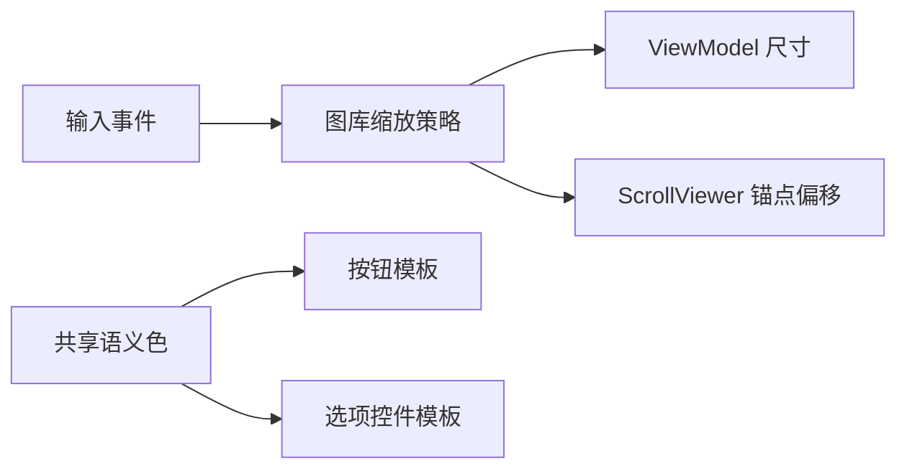

# 照片图库滚动缩放与全局控件对比度实施计划

> **执行要求：** 使用 `executing-plans` 按测试先行顺序实施。

**目标：** 用单一协调器接管图库滚动缩放，集中修复控件对比度，验证全部功能后安全发布与提交。

**架构：** 将与 WPF 输入无关的缩放计算提取为可测试策略；`MainWindow` 只负责读取鼠标与 `ScrollViewer` 状态并应用结果。视觉修复集中在共享控件资源，页面不增加平行样式。

**技术栈：** .NET 8、C# 12、WPF、xUnit、FluentAssertions。

## 全局约束

- 不写入 OneDrive，不设置锁定或只读属性。
- 不覆盖或提交无关既有修改。
- 先看到测试因预期原因失败，再写生产代码。
- 只清理经引用和运行验证确认无用的相关文件。

### 任务一：建立图库缩放回归保护

**文件：**
- 新建：`src/HanabePhotoManager.App/Browsing/Grid/GalleryZoomPolicy.cs`
- 测试：`tests/HanabePhotoManager.App.Tests/Browsing/Grid/GalleryZoomPolicyTests.cs`
- 修改：`tests/HanabePhotoManager.App.Tests/PreviewPerformanceTests.cs`

- [ ] 编写普通滚轮不缩放、Ctrl 滚轮尺寸边界、鼠标锚点偏移和无效视口输入测试。
- [ ] 运行定向测试并确认因策略不存在而失败。
- [ ] 实现纯计算策略并使测试通过。
- [ ] 增加 XAML/事件接线测试，要求普通滚轮路径与工具栏入口使用同一协调逻辑。

### 任务二：替换图库页面旧滚动与缩放实现

**文件：**
- 修改：`src/HanabePhotoManager.App/MainWindow.xaml`
- 修改：`src/HanabePhotoManager.App/MainWindow.xaml.cs`
- 修改：`src/HanabePhotoManager.App/ViewModels/MainWindowViewModel.cs`（仅在统一命令确有必要时）

- [ ] 连接 Ctrl 滚轮锚点缩放，普通滚轮交还标准 `ScrollViewer`。
- [ ] 给减号、滑块、加号和重置接入同一缩放入口。
- [ ] 使用布局调度代次恢复最新锚点，并使旧请求失效。
- [ ] 删除被替换的旧图库滚轮缩放和重复偏移修正代码。
- [ ] 运行图库相关测试并确认虚拟化、筛选与选择结构不变。

### 任务三：全局按钮与选项控件对比度治理

**文件：**
- 修改：`src/HanabePhotoManager.App/Themes/Controls/Buttons.xaml`
- 修改：`src/HanabePhotoManager.App/Themes/Controls/Inputs.xaml`
- 修改：`src/HanabePhotoManager.App/Themes/Controls/Selection.xaml`
- 按检查结果修改：`src/HanabePhotoManager.App/App.xaml`、`src/HanabePhotoManager.App/Themes/Controls/Navigation.xaml`
- 测试：`tests/HanabePhotoManager.App.Tests/ControlThemeTests.cs`
- 测试：`tests/HanabePhotoManager.App.Tests/DesignSystemResourceTests.cs`

- [ ] 先写共享模板覆盖、禁用态可读性和无系统灰色矩形回归测试并确认失败。
- [ ] 修复按钮各状态的前景、背景和边框语义资源绑定。
- [ ] 为复选框、单选框、ComboBox 和分段选项提供完整共享模板或移除冲突的页内隐式模板。
- [ ] 运行设计系统与控件主题测试。

### 任务四：构建、发布和鼠标逐页验证

- [ ] 运行 Release `/warnaserror` 构建及全量测试。
- [ ] 发布到临时 D 盘目录并先运行烟测。
- [ ] 安全更新 `D:\hanabe-publish-v2`，不设置文件属性。
- [ ] 使用鼠标逐页检查全部可达功能和六套主题，记录按钮、选项控件与图库交互结果。
- [ ] 对发现的问题重复测试先行修复与回归。

### 任务五：安全清理、文档和 Git

**文件：**
- 修改：`docs/agent-change-log.md`
- 修改：`docs/current-status.md`
- 按需修改：`docs/known-issues.md`
- 修改：`AGENT_HANDOFF.md`

- [ ] 使用项目引用、资源引用和发布运行结果审计候选无用文件。
- [ ] 仅删除已证明无引用的本次相关旧文件或临时发布残留，并复跑烟测。
- [ ] 更新中文变更记录与验证证据。
- [ ] 检查 Git 差异，只暂存本任务文件，创建聚焦提交。
