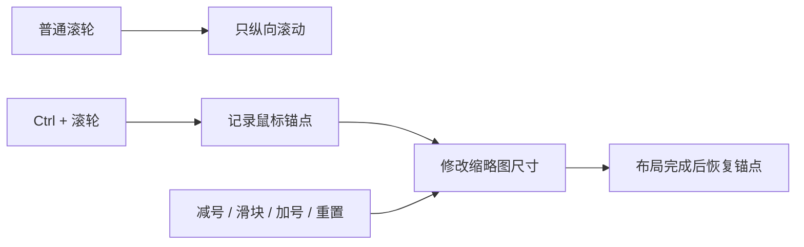
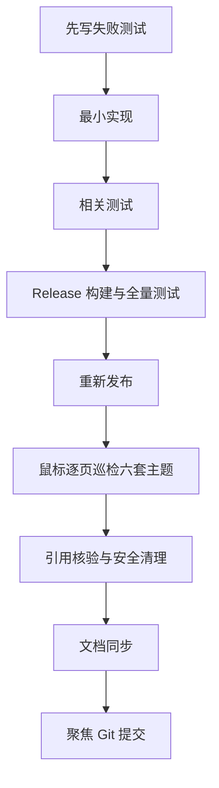

# 照片图库滚动缩放与全局控件对比度设计

## 目标

重写照片图库页面的滚动与缩略图缩放逻辑，统一修复六套主题下按钮及选项控件的低对比度和灰色矩形残留，并将验证后的程序重新发布到 `D:\hanabe-publish-v2`。

## 范围

- 源码只修改 `D:\HanabePhoto`，发布到 `D:\hanabe-publish-v2`，不写入 OneDrive。
- 现在及以后均不设置文件锁定或只读属性。
- 保留当前所有页面、命令、绑定、选择、筛选、缩略图加载、虚拟化和独立照片查看器缩放。
- 只删除重写后经引用检查确认无用的旧图库滚动/缩放代码、资源和临时发布残留；不删除运行库、语言包、模型、媒体组件、用户设置或照片数据。

## 图库交互

- 普通滚轮只滚动，不改变缩略图尺寸。
- `Ctrl + 滚轮` 平滑缩放，并保持鼠标下方照片位置稳定。
- 减号、滑块、加号、重置和滚轮共用一套缩放状态与边界。
- 快速交替缩放可中断，旧的偏移修正不得覆盖最新输入。
- 保持图库虚拟化、视口优先加载、选择和筛选行为。
- 树图语义缩放与独立照片查看器缩放不属于本次重写。

## 按钮与选项控件

覆盖动态色彩、森林绿、紫罗兰三套配色的浅色与深色主题，检查正常、悬停、按下、选中、焦点和禁用状态。

- 优先修复共享 `Buttons.xaml`、`Inputs.xaml`、`Selection.xaml` 和主题语义资源，不做逐页颜色补丁。
- 主按钮、次按钮、危险按钮、工具栏、图标、导航、Chip、FAB、对话框按钮保持当前 M3 层级。
- 下拉框、复选框、单选框、开关和分段选项不得露出系统默认或旧模板的灰色矩形。
- 禁用态可以减弱，但文字和图标仍需可识别；焦点态不得遮挡内容。

## 验证与交付

- 鼠标逐页检查导航、按钮、选项控件、图库滚动与缩放、选择、筛选、加载、空状态和对话框。
- 新截图不覆盖旧证据；无法到达的状态明确记录为未验证。
- 构建、全量测试、新发布版本运行巡检均通过后才提交 Git，且不包含无关的既有工作区改动。

## 完成标准

- 普通滚轮不再改变缩略图尺寸。
- `Ctrl + 滚轮` 与工具栏控制同步且锚点稳定。
- 当前图库性能与全部现有功能没有回归。
- 六套主题中已检查按钮的文字与图标清晰，无选项控件灰色矩形残留。
- 没有误删任何运行依赖或用户文件。
